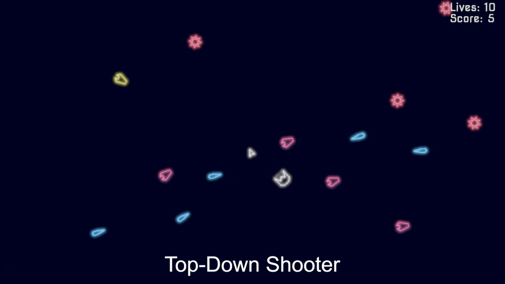
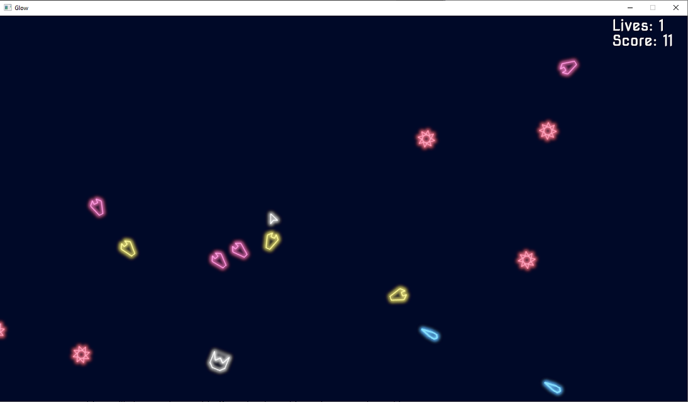
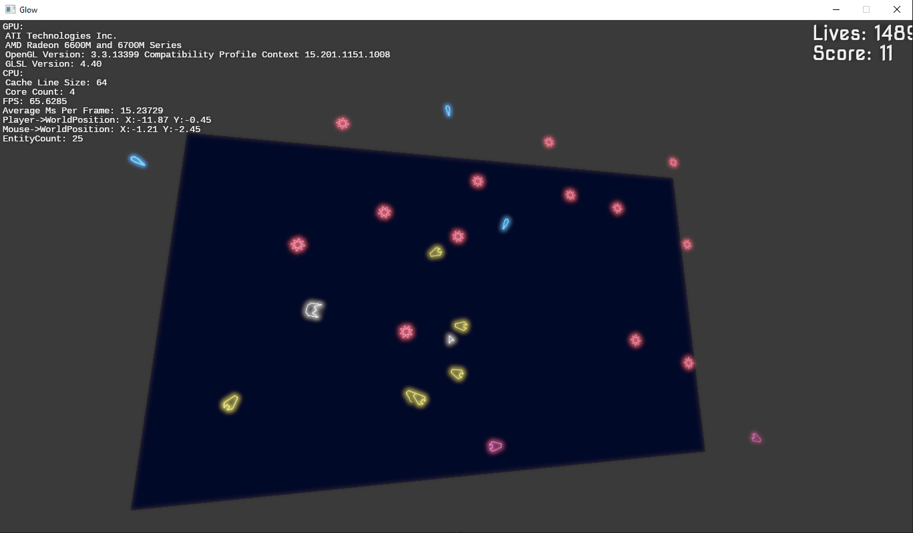
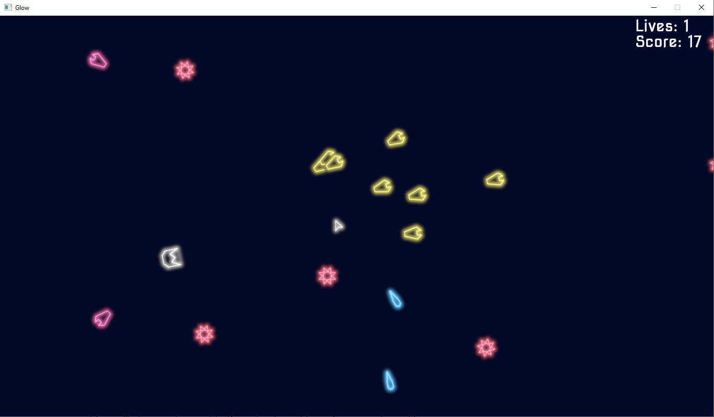
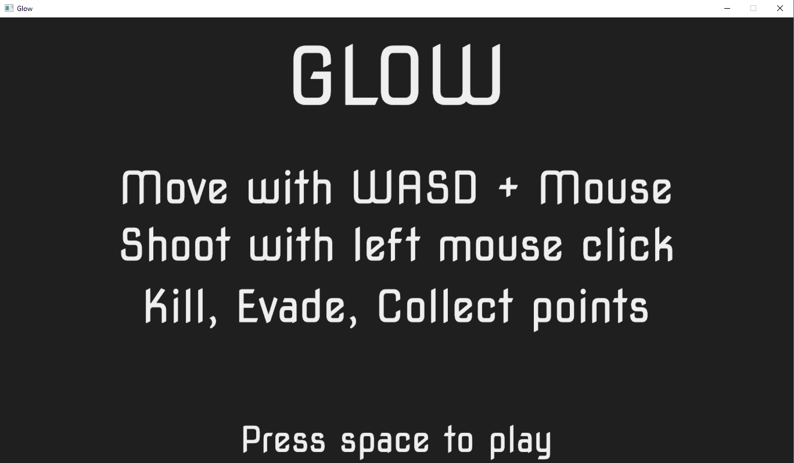
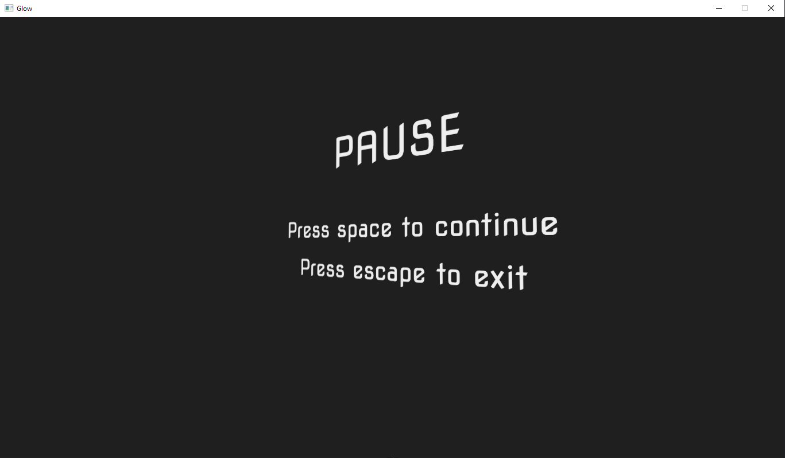
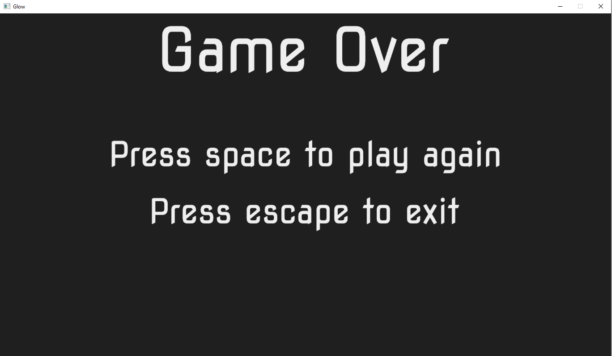

# Glow



▶ [Watch in full quality on YouTube](https://youtu.be/Y5EoJorOp7E)

A C++ / OpenGL game project focused on real-time rendering, gameplay programming, and low-level game systems.

## Features

### Rendering

* Modern OpenGL
* HDR rendering
* Bloom
* Gamma correction
* FreeType text rendering
* Textured quads
* Debug mode with live frame stats and collider rendering

### Gameplay

* SAT collision detection
* Xorshift random number generator
* Player movement and shooting
* Scoring system
* SDL audio

## Screenshots








## Build

### Requirements

* Windows
* Visual Studio 2019 with C++ development tools

### Instructions

1. Open **x64 Native Tools Command Prompt for VS 2019**.
2. Navigate to the project directory.
3. Run:

```text
build.bat
```

4. The executable will be generated in the `build` directory as `main.exe`.

> **Note:** The build must be performed from the x64 Native Tools command prompt.

## How to Play

* **WASD** — Move
* **Left Mouse Button** — Fire toward the mouse cursor

Kill enemies, evade attacks, and collect points.

## Debug Mode

Press **F1** to toggle debug mode.

While debug mode is enabled:

* **Shift + WASD** — Move the camera
* **Shift + Space** — Reset the camera

Debug information is displayed on screen while debug mode is active.

## Render Toggles

Available during gameplay:

* **F2** — Toggle HDR tone mapping (off clamps colors instead)
* **F3** — Toggle bloom
* **F4** — Toggle drawing of entity collision primitives

## License

Public domain. See [LICENSE](./LICENSE).
